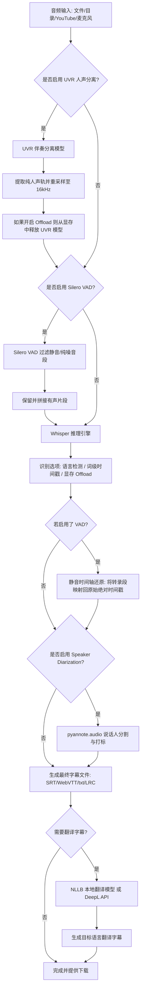

# 项目相关命令

创建环境：
```shell
uv venv --python ">=3.10,<3.13"
```
安装依赖：
```shell
uv pip install -r requirements.txt
```
启动项目：
```shell
uv run python app.py
```

http://127.0.0.1:7860/

# 可调节参数

## 🎙️ VAD (语音激活检测) 原理与参数说明

### 什么是 VAD？
**VAD (Voice Activity Detection，语音激活检测)** 是一种判断音频信号中是否存在“人声说话”的技术。
在语音识别（ASR）任务中，如果音频中包含大量的静音、环境噪音、叹气、呼吸或纯音乐（无歌词），直接送入 Whisper 等模型识别会极易导致模型产生**幻觉、胡乱猜测或陷入无限重复句子的死循环**。
VAD 通过一个轻量级的深度学习网络（项目中使用的是 **Silero VAD**）提前扫描音频：
1. **静音裁剪**：将没有说话声的区间过滤掉，只保留有说话声的音频段（Speech Chunks）。
2. **切片拼接**：将这些有人声的片段拼接成较长且连贯的音频流送给 Whisper 进行精准转录。
3. **时间戳还原**：在转录完成后，结合 VAD 切片时的原始物理坐标，将字幕的开始和结束时间还原到原视频对应的真实时间线上。

---

### VAD 参数详细说明与调节指南

| 参数名称 | 参数字段 | 默认值 | 物理含义与调节建议 |
| :--- | :--- | :--- | :--- |
| **Speech Threshold**<br>(人声概率阈值) | `threshold` | `0.5` | **含义**：判断为“有人在说话”的最低概率临界值（范围 0.0 - 1.0）。<br>**调节建议**：数值越低系统越敏感（哪怕叹气、微弱耳语也会被算作人声）；数值越高越严格。如果视频背景噪音很大（如雨声、白噪音），请**调高**到 `0.6 - 0.7` 防止噪音被误识；如果说话声音非常微弱，请**调低**到 `0.3 - 0.4`。 |
| **Minimum Speech Duration**<br>(最小说话时长) | `min_speech_duration_ms` | `250 ms` | **含义**：人声片段被判定为有效句子的最短时长，短于该值将被视为瞬时杂音（如敲桌子、咳嗽、爆音）直接过滤。<br>**调节建议**：默认 250 毫秒即可。如果你发现极短的语气词（如“啊”、“哦”）总是漏掉，可以适当**调低**；若希望过滤短促的环境撞击声，可以**调高**。 |
| **Maximum Speech Duration**<br>(最大说话时长) | `max_speech_duration_s` | `inf` (无限制) | **含义**：允许将人声切片的最大长度上限（秒）。<br>**调节建议**：如果音频中有人滔滔不绝完全没有停顿，VAD 会将它们合并为一个巨长的切片。给该值设置一个限制（如 `15` 或 `30` 秒）可以强制进行物理切片，防止传给 Whisper 的单段音频过长导致其显存溢出或解码注意力衰减。 |
| **Minimum Silence Duration**<br>(最小静音间隔) | `min_silence_duration_ms`| `2000 ms` | **含义**：两条说话片段之间，至少需要保持**多长的连续静音时间**，才将它们拆分为两个独立的字幕句子。<br>**调节建议**：默认 2000 毫秒（2 秒）。**数值越小**，只要说话人停顿一下，字幕就会断开成新的一行（字幕会变得短小而密集）；**数值越大**，字幕行与行之间合并越连贯。对于语速慢、停顿多的说话者，可以适当**调大**；对于语速快或抢话的对话，可以**调小**。 |
| **Speech Padding**<br>(语音边缘缓冲时间) | `speech_pad_ms` | `400 ms` | **含义**：在人声片段的开始和结尾，各向外多圈出一段静音缓冲时间（毫秒），确保不破坏说话的首尾音。<br>**调节建议**：默认 400 毫秒。如果发现字幕经常出现“吞字头”（第一声字没录上，如 "hello" 丢掉 "he" 变成 "llo"）或“吞字尾”，应该**增大**该缓冲时间，提供更充裕的边界。 |


# Whisper-WebUI 项目运转流程与步骤详解

`Whisper-WebUI` 是一个基于 Gradio 构建的强大浏览器界面，专门用于利用 OpenAI 的 Whisper 模型进行语音转录、字幕生成和翻译。为了保障高效、精准的转录体验，项目集成了丰富的前处理（去噪、伴奏人声分离、静音检测）与后处理（时间戳还原、说话人识别、翻译）流程。

---

## 🛠️ 项目整体架构与工作流

项目内部的核心运转流程可以通过以下流程图来直观表示：



---

## 📝 运转步骤详解

### 1. 音频输入阶段 (Audio Input)
项目支持多种灵活的音频/视频输入来源：
- **文件上传 (Upload File)**：通过 Gradio 的文件上传接口上传本地媒体文件。
- **本地目录批量扫描 (Folder Path)**：支持指定本地文件夹路径，并可配置是否递归扫描子目录文件。
- **YouTube 链接转录 (YouTube Link)**：输入 YouTube URL，后台自动下载其音轨。
- **麦克风录音 (Microphone)**：在网页端直接录音并进行识别。

### 2. 前处理阶段 (Pre-processing Filters)
为了极大提高 Whisper 模型的识别纯净度和转录速度，项目提供了两大过滤网：

* **背景音乐分离器 (UVR Filter)**
  > [!NOTE]
  > 背景音乐（BGM）和环境噪音会对 Whisper 识别精度产生巨大干扰。
  > 项目使用 **UVR (Ultimate Vocal Remover)** 相关的 API，将上传的媒体流分离为“伴奏/乐器声”和“纯人声（Vocal）”。
  - 提取纯人声后，统一转为单声道，并重采样为 **16000Hz**（Whisper 接受的基准采样率）。
  - 若开启了 **Offload（卸载模型）** 选项，在分离完成后，UVR 模型的权重将立即从 GPU 显存中卸载，释放显存以备 Whisper 转录使用。

* **静音过滤 / 语音激活检测 (Silero VAD Filter)**
  > [!TIP]
  > 如果音频中有大段的静音或纯噪声，Whisper 在这些区间容易出现“幻听”（不断重复输出某个虚无的词汇）或浪费大量的推理算力。
  - 项目集成了高精度的 **Silero VAD**。
  - 若开启 `vad_filter`，系统会扫描整条音轨，检测出有人说话的片段（Speech Chunks），并将没有声音的空白区间裁剪掉。
  - 被拼接后的“纯有声片段”将被送入 Whisper 模型进行转录，转录所需算力减半，也彻底规避了空白处幻听的硬伤。

### 3. 模型推理阶段 (Whisper Transcription)
用户可以根据自身的硬件条件，在前端界面或命令行参数中自由挑选三种不同的 Whisper 推理引擎：

| 推理引擎 | 特点与说明 | 显存与速度优势 |
| :--- | :--- | :--- |
| **faster-whisper** *(默认推荐)* | 使用 `CTranslate2` 重写的 PyTorch 模型实现，支持 fp16、int8 等多种量化精度。 | 转录速度较官方原版提升 **4~5 倍**，且显存占用降低超过 **50%**。 |
| **openai/whisper** | OpenAI 官方的原生实现，支持原汁原味的模型加载和各类原生参数。 | 对显存要求较高，速度为基准参考速度。 |
| **insanely-fast-whisper** | 结合了 `Transformers` 与 `Flash Attention` 的优化流水线。 | 配合大显存显卡，能在极短时间内处理超长音频。 |

在转录过程中，还可以配置多种参数：
- **自动语言检测 (Automatic Language Detection)**：不指定语言时，模型在音频开头自动判定语种。
- **词级时间戳 (Word Timestamps)**：不仅给出整句话的起止，还精准给出每个词或字符的起止点。
- **直译成英文 (Translate to English)**：利用 Whisper 的翻译解码头，将非英文语音直接转录为英文文本。

### 4. 后处理阶段 (Post-processing)
当 Whisper 完成有声片段的推理后，数据将进行校正与融合：

* **时间轴还原 (VAD Speech Timestamps Restoration)**
  > [!IMPORTANT]
  > 由于在 VAD 过滤步骤中，所有的空白区间都被裁剪拼接，Whisper 识别出的是“无静音拼接版”的时间轴。
  - 程序会自动读取记录在 `speech_chunks` 中的相对坐标。
  - 通过 `restore_speech_timestamps` 函数将每个字幕块的时间轴逆向平移、拆分，将其完美映射回**原始音频的绝对时间轴**上，确保字幕与画面音频同步。

* **说话人分割 (Speaker Diarization)**
  - 项目集成 **pyannote.audio** 说话人识别模型。
  - 通过提取声纹特征，识别出哪个时间段是哪个角色在说话。
  - 识别出的说话人 ID（例如 `[SPEAKER_00]`）将自动插入到最终生成的字幕条目开头。

### 5. 翻译阶段 (Subtitle Translation)
除了 Whisper 的“直接转译英文”外，项目还支持在生成字幕后进行跨语言的文字翻译：
- **NLLB 翻译**：使用 Meta 的开源大语言翻译模型（NLLB），支持数百种语言之间的本地高质量离线翻译。
- **DeepL API 翻译**：如果用户拥有 DeepL 的开发者密钥，也可以使用其高水准的云端翻译引擎。

### 6. 输出与导出 (Output & File Generation)
所有转录和处理好的数据最终会被序列化并格式化写入到本地文件中。支持的导出格式有：
- **SRT (.srt)**：标准的 SubRip 字幕格式（最通用）。
- **WebVTT (.vtt)**：网页端通用的 Web 视频字幕格式。
- **LRC (.lrc)**：带时间标签的同步歌词文本。
- **txt (.txt)**：去除了时间戳的纯文本合并文档。

默认保存在 [outputs](file:///home/lambert/code/Whisper-WebUI/outputs) 目录下，用户可直接在网页端点击下载或管理。
